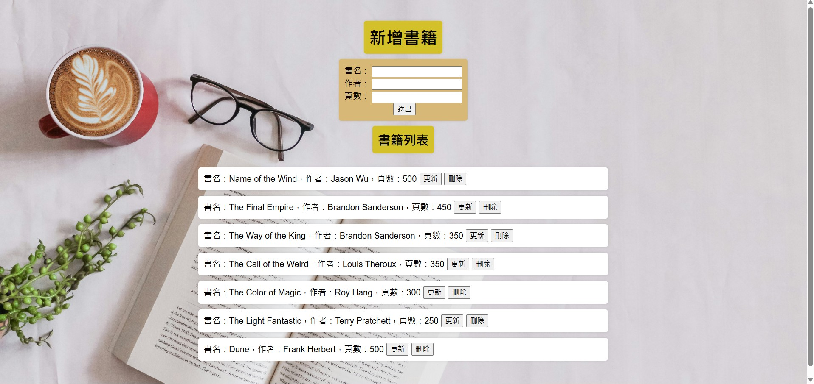
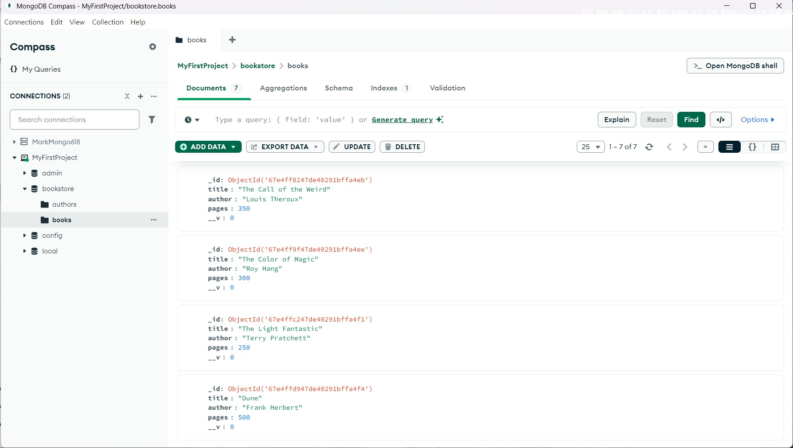

這是一個前端網頁可以新增、更改、刪除書籍，後端使用Node.js寫，資料庫使用MongoDB。
前端網頁為index.html，後端程式碼為server.js。
在專案資料夾用vscode開啟
```
node server.js
```
<br>
前端介面的圖片如下:
<div align="center">
  
</div>
<br>
<br>
MongoDB的介面如下:
<div align="center">
  
</div>
